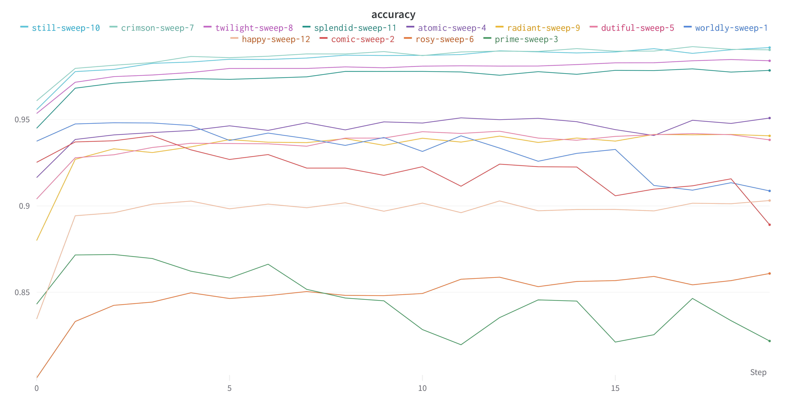
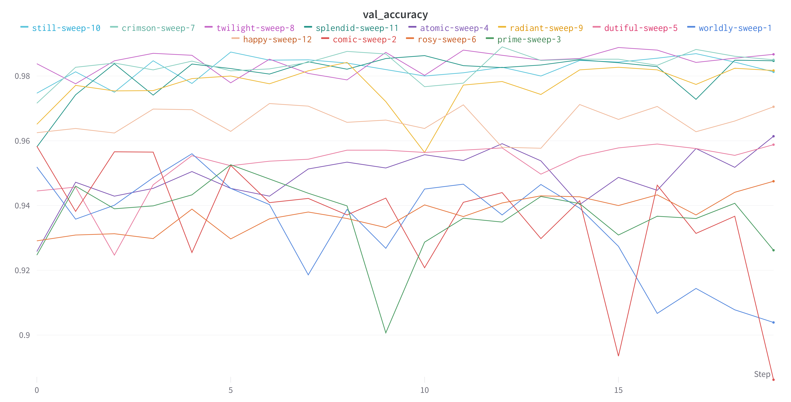

# LeNet-5
[_Introduction by Ivanovitch Silva_](https://github.com/ivanovitchm/embedded.ai/blob/main/lessons/week_08/LeNet.ipynb)

Perhaps the first widely known and successful application of convolutional neural networks was **LeNet-5**, described by Yann LeCun, et al. in their 1998 paper titled [Gradient-Based Learning Applied to Document Recognition](https://ieeexplore.ieee.org/document/726791). The system was developed for use in a handwritten character recognition problem and demonstrated on the **MNIST standard dataset**, achieving approximately 99.2% classification accuracy (or a 0.8% error rate). The network was then described as the central technique in a broader system referred to as **Graph Transformer Networks**.

It is a long paper, and perhaps the best part to focus on is Section II. B. that describes the LeNet-5 architecture. In that section, the paper describes the **network as having seven layers** with input **grayscale images** having the shape **32 x 32**, the size of images in the **MNIST dataset**. 

> The model proposes a pattern of a convolutional layer followed by an average pooling layer, referred to as a **subsampling layer**. 

This pattern is repeated two and a half times before the output feature maps are flattened and fed to some fully connected layers for interpretation and a final prediction. A picture of the network architecture is provided in the paper and reproduced below.

The pattern of blocks of convolutional layers and pooling layers (referred to as **subsampling**) grouped and repeated **remains a typical pattern in designing and using convolutional neural networks today, more than twenty years later**. Interestingly, the architecture uses a small number of filters with a modest size as the first hidden layer, specifically 6 filters, each with 5x5 pixels. After pooling, another convolutional layer has many more filters, again with the same size, precisely 16 filters with 5x5 pixels, again followed by pooling. In the repetition of these two blocks of convolution and pooling layers, the trend increases the number of filters.

Compared to modern applications, the number of filters is also small, but **the trend of increasing the number of filters with the depth of the network also remains a common pattern in modern usage of the technique.** The flattening of the feature maps and interpretation and classification of the extracted features by fully connected layers also remains a common pattern today. 

> In modern terminology, the **final section of the architecture** is often referred to as the **classifier**, whereas the **convolutional and pooling layers** earlier in the model are referred to as the **feature extractor**.

We can summarize the key aspects of the architecture relevant in modern models as follows:

- Fixed-sized input images.
- Group convolutional and pooling layers into blocks.
- Repetition of convolutional-pooling blocks in the architecture.
- Increase in the number of filters with the depth of the network.
- Distinct feature extraction and classifier parts of the architecture.

# But What If....

Even though LeNet is awesome, couldn't we improve it? For example...
- the original lenet uses _tanh_ activation function. On the other hand, [Goodfellow et al.](https://www.deeplearningbook.org/contents/mlp.html) (2016) comments that _ReLu_ activation function is easier to optimize; 
- [Dropout (2014)](https://www.cs.toronto.edu/~rsalakhu/papers/srivastava14a.pdf) and [Batch Normalization (2015)](https://arxiv.org/abs/1502.03167) are popular ideas that appeared only a decade after the LeNet was published.

Thus, this is a good opportunity to try them out. In order to do this, let's use [WandB Sweeps](https://docs.wandb.ai/guides/sweeps). 

The Intro were borrowed from [Ivanovitch Silva's code](https://github.com/ivanovitchm/embedded.ai/blob/main/lessons/week_08/LeNet.ipynb). The project, located at `./assignment/ModifiedLeNet.ipynb`, is a modified version of Ivanovitch's work. Contrary to the original file, though, this one does not contain Data Augmentation and does not explicitly implement the IvanNet, since the goal is to try the use of ReLu, Dropout and BatchNorm. It is important to notice that, by using Dropout and BatchNorm, we try IvanNet as well (since these modifications were applied in it).

If you want to know how it was done, read the notebook and see the [wandb runs](https://wandb.ai/mtxslv/lenet-5-assignment?workspace=user-mtxslv). If you want to read a summary of the results, stick around.

# Results

First, let's see the Accuracy and the Validation Accuracy Graphs.

In the (train) accuracy graphs, we see there are four runs whose accuracy was greater than 0.95

| run name        | train accuracy |
| :--:            |      :---:     |
| still-sweep-10  | 0.9916         |
|crimson-sweep-7  | 0.9903         |
|twilight-sweep-8 | 0.984          |
|splendid-sweep-11| 0.9784         |

and only two with "low" accuracies

| automatic name  | train accuracy |
| :--:            |      :---:     |
| rosy-sweep-6    | 0.8609         |
|prime-sweep-3    | 0.8218         |

The bigger train accuracy repeats on the validation accuracy for the 
- twilight-sweep-8 (0.9867);
- crimson-sweep-7 (0.985);
- splendid-sweep-11 (0.9847)
(the still-sweep-10 is the fifth one there, being passed by radiant-sweep-9).

Since there are four really distinct best accuracies, we may think: what do they have different? Let's take a look:

| run name        | train accuracy | activation_function | batch norm | dropout |
| :--:            |      :---:     | :---:               |  :---:     |  :--:   |
| still-sweep-10  | 0.9916         | relu                | false      | 0.0     | 
|crimson-sweep-7  | 0.9903         | relu                | true       | 0.0     |
|twilight-sweep-8 | 0.984          | relu                | true       |  0.1    |
|splendid-sweep-11| 0.9784         | relu                | false      | 0.1     |

This result is really curious. The use of relu activation function is ubiquitous, which may reinforce the use of such activation function in this problem. The other parameters, on the other hand, have different values. The use or not of Dropout and Batch Normalization is equally distributed amongst the runs.

What about the "worse" results?

| run name        | train accuracy | activation_function | batch norm | dropout |
| :--:            |      :---:     | :---:               |  :---:     |  :--:   |
| rosy-sweep-6    | 0.8609         | tanh                | false      |    0.5  |
|prime-sweep-3    | 0.8218         | tanh                | true       |    0.5  |

The smaller accuracies came from the networks that employed the _tanh_ activation function and a strong dropout. Here, the use of Batch Normalization varies in the runs. This may indicates that the use of BatchNorm does not affect the runs as much as the other parameters.